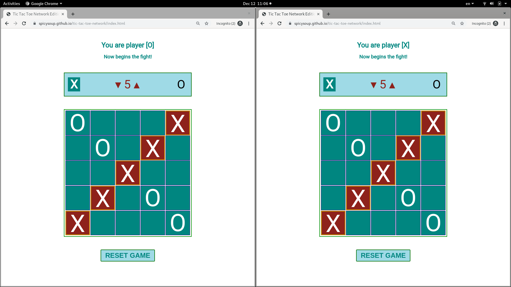
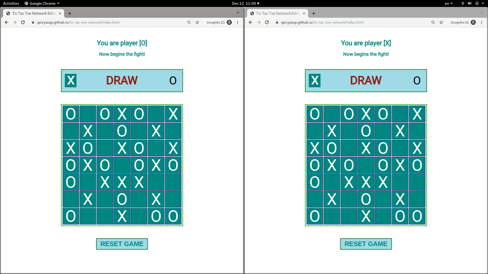

# Background
This is a simplistic implementation of the game _[Tic-Tac-Toe](https://en.wikipedia.org/wiki/Tic-tac-toe)_ as a web application.

The purpose of this project is to practise the basics of front-end web development. 

# Main features
* Two players competing across the network.
* Customisable dimension of the game board, from 3 by 3 to 8 by 8.
* Capability to detect a draw and a win.
* Option to reset and restart the game.

# How to play
Go to https://spicysoup.github.io/tic-tac-toe-network/index.html and invite your peer to do the same.

The person who visited the URL first will be given the __X__ call sign and will be able to move first.

When a winner appears or a draw occurs, the game will be locked down. Either player can click the "Reset Game" button to start a new round.

Any time during a game session, either player can increase or decrease the board's dimension. Please note that the existing moves will be cleared after that.

# Technologies and tools used
* HTML, CSS and JavaScript.
* [Firebase](https://firebase.google.com)
* [npm](https://www.npmjs.com), [webpack](https://webpack.js.org) and [Babel](https://babeljs.io)

# Database schema
To coordinate the two players' move, the following data structure has been used:
